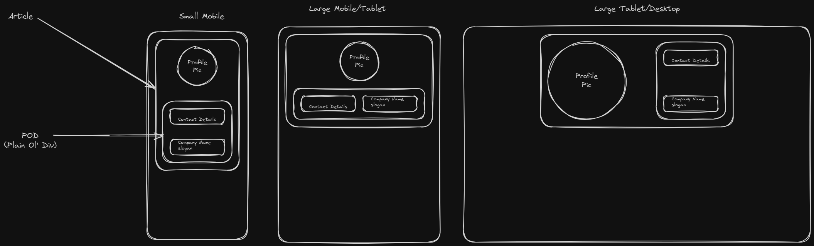

# Contact Card Assignment

The purpose of this challenge is to create a responsive contact card using flexbox and/or grid. The card can be for you personally or for a fictitious character. In the previous exercises you were provided code to focus on semantic HTML, Flexbox, and Grid. In this exercise, it will be up to you to build the project.

The first deliverable will require you to think about the structure and content of your contact card by creating your own mockups. The mockups do not have to be incredibly detailed, but they should be clear enough to show that you have thought about the design. You must have at least two mockups, one for a small mobile device and one for a large mobile device/tablet. These will be stored in the "mockups" folder. **DO NOT** write any code before this deliverable. We will spend time during the next meeting discussing your mockups and any blockers regarding the task. I have included a simple mockup in the “mockups” folder and below

  

## Instructions

### Prerequisites

Before you begin, ensure you have the following installed:

- **Git:** Version control system to clone and manage the repository.
- **GitHub:** make sure you have an account to sync your repositories to.
- **Code Editor:** Any code editor like [Visual Studio Code](https://code.visualstudio.com/)

### Cloning the Repository

Follow these steps to fork and clone the repository:

1. Open your terminal or Git Bash.
2. Navigate to the directory where you want to store the project.
3. Fork the repository.
4. Clone the forked repository to edit on your local computer.

### Viewing the Project

To view the project locally, you can either open the project files in your code editor or open the HTML files in your browser.

### Tasks

Once again, **DO NOT** write any code before deliverable has been turned in and discussed in the following meeting.

#### Deliverable 1

- [ ] Create at least two mockups of your contact card. 

#### Deliverable 2

Write your own HTML and CSS according to your mockups. Your contact card must have the following:

- index.html
    - [ ] A Profile Image
    - [ ] Name
    - [ ] Title
    - [ ] Phone Number
    - [ ] Company Name

- style.css
    - [ ] Include the css reset in this file. If unsure how to do this, refer to the last assignment.
    - [ ] Write at least one media query to reflect the two layouts in your mockups.

### Submitting Your Work

After completing each deliverable, be sure to commit your changes and push them back to your own forked repository and turn in the GitHub link in Google Classroom.