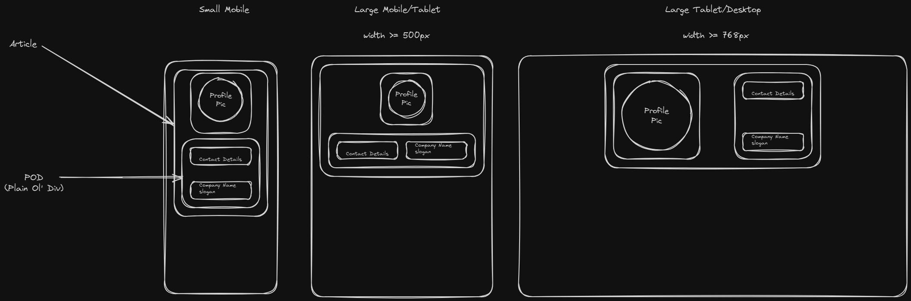

# Contact Card Assignment

The purpose of this challenge is to create a responsive contact card using flexbox and/or grid. The card can be for you personally or for a fictitious character. In the previous exercises you were provided code to focus on semantic HTML, Flexbox, and Grid. In this exercise, it will be up to you to build the project.

  

## Instructions

### Prerequisites

Before you begin, ensure you have the following installed:

- **Git:** Version control system to clone and manage the repository.
- **GitHub:** make sure you have an account to sync your repositories to.
- **Code Editor:** Any code editor like [Visual Studio Code](https://code.visualstudio.com/)

### Cloning the Repository

Follow these steps to fork and clone the repository:

1. Open your terminal or Git Bash.
2. Navigate to the directory where you want to store the project.
3. Fork the repository.
4. Clone the forked repository to edit on your local computer.

### Viewing the Project

To view the project locally, you can either open the project files in your code editor or open the HTML files in your browser.

### Tasks
In `index.html`, add the following for your contact card:
- [ ] A Profile Image (your image should be stored in the images folder)
- [ ] A Name
- [ ] Title
- [ ] Phone Number
- [ ] Company Name

In `style.css`, do the following:
- [ ] Include the css reset in this file. If you are unsure how to do this, please refer to the last assignment.
- [ ] Write two media queries to account for larger sized screens. Use the breakpoint sizes from the example wireframe or adjust them to fit your card.
- [ ] Ensure that your card is centered horizontally on all device sizes.

**BONUS**
- [ ] Make your contact card centered vertically, as well as horizontally.

### Submitting Your Work

After completing the assignment, make sure to commit your changes and push them back to your own repository and turn in the GitHub link in Google Classroom.